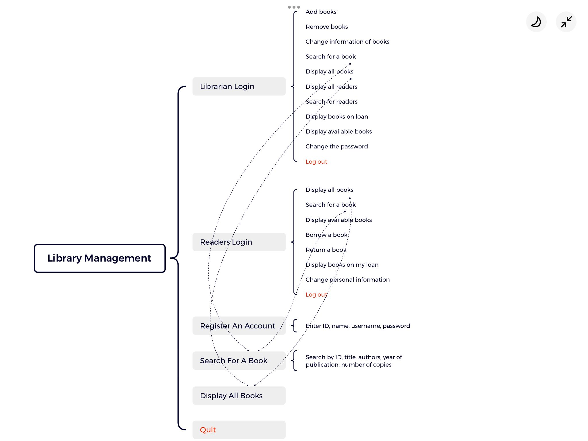
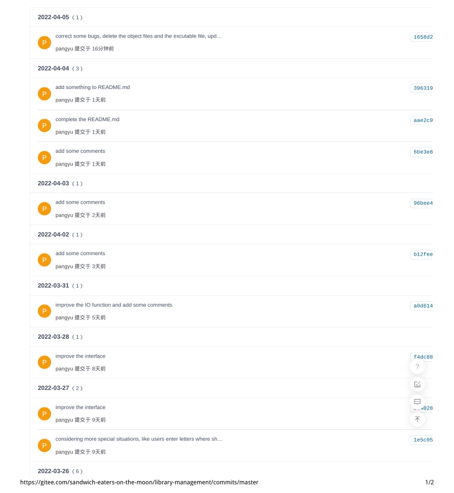
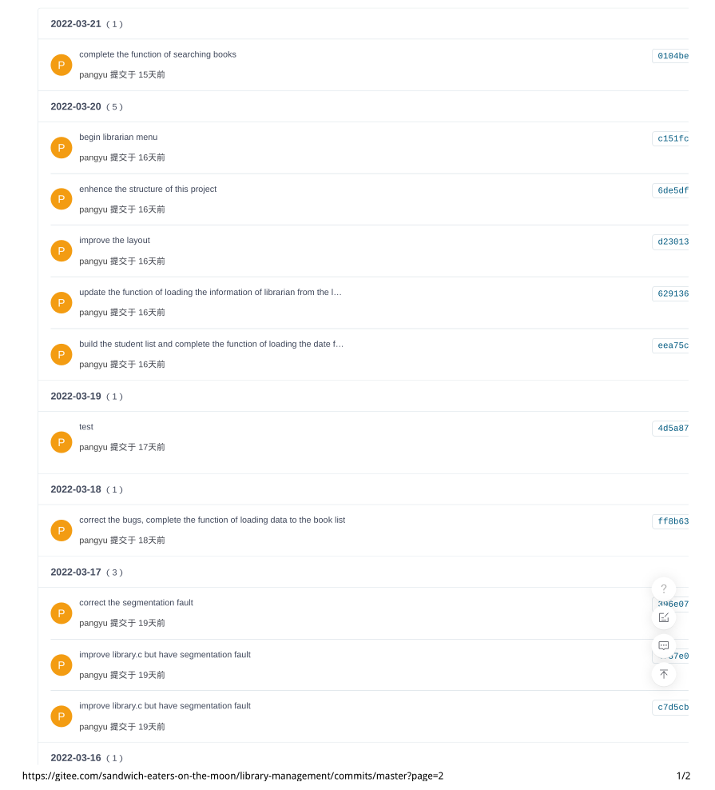
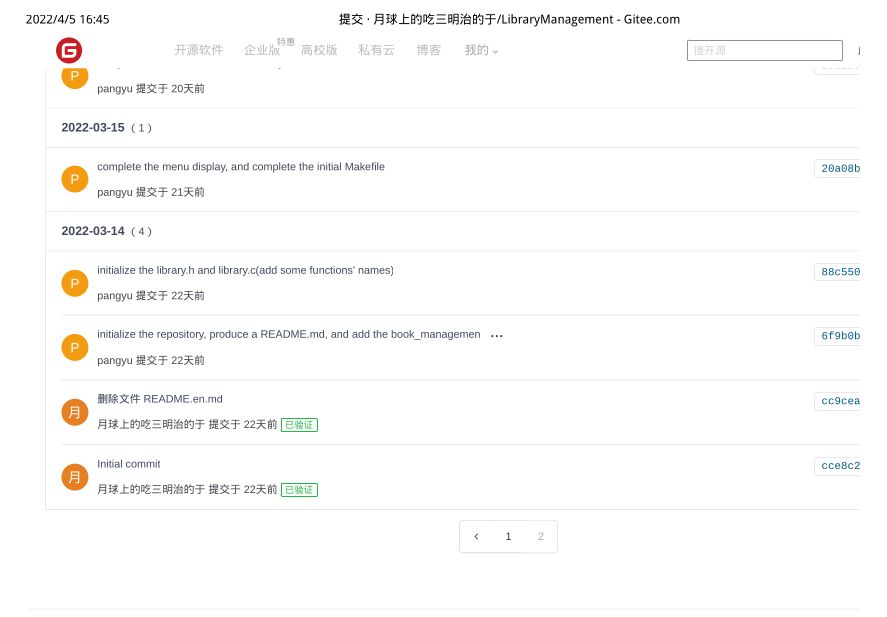

## Library Management

#### 1. Introduction

+ Programming Project cwk1
+ a software based on the command line

#### 2. Basic structure and functions

#### 3. How to use:

1.  In the root directory of the project, enter  'make'  in the command line. Then, the executable file named 'library' will be produced in the bin directory. 
2.  In the bin directory, use command './library' to run the executable file 'library'.
3.  At the beginning, there is no book and no reader registered in the library. The librarian need to log in the system to add books. After quiting the system at first, the 'books.txt' will be produced in the bin directory, which is used to record books information.
3.  In the bin directory, the 'readers.txt', 'librarian.txt', 'borrowInformation.txt' have already been there, which are separately used to record readers' information, the librarian's information and the lent books' information. 
3.  **Don't rename, remove or alter the txt files in the bin directory!!!!!**
3.  **The student ID and book ID are set in [1, 999]!!**
3.  **The password for readers and the library must have at least length 6!!**
3.  **A reader can only borrow one book for one kind, and at most 5 books!!**
3.  <u>**The origin username of the librarian: leeds123**</u>

​	   <u>**The origin password of the librarian: leeds123**</u>

#### 4. The remote repository:

**https://gitee.com/sandwich-eaters-on-the-moon/library-management**

**For git clone:**

+ **HTTPS:    https://gitee.com/sandwich-eaters-on-the-moon/library-management.git**
+ **SSH :    git@gitee.com:sandwich-eaters-on-the-moon/library-management.git**

#### 5. The screenshot for git record:

